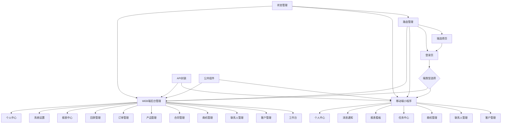
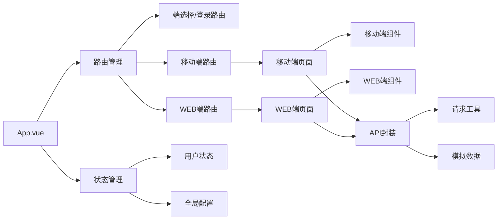
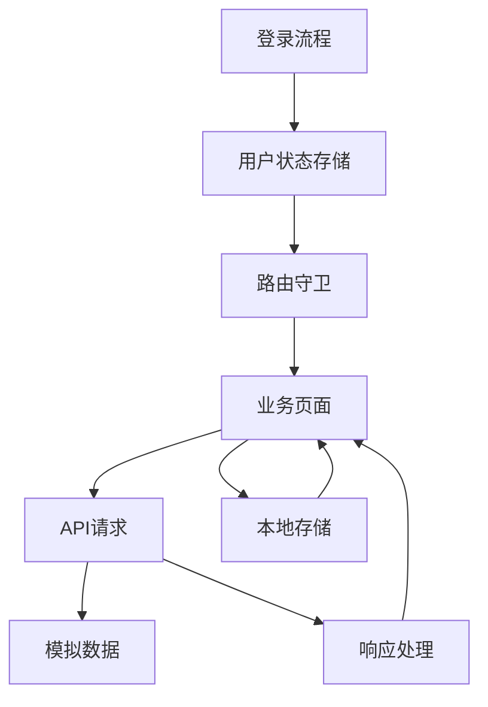

# 技术架构设计文档 - Vue前端代码生成

## 整体架构图



## 系统分层设计与核心组件定义

### 1. 核心层
- **Vue 3 核心**：提供响应式数据绑定和组件化开发
- **Composition API**：使用 `<script setup>` 语法，提供更好的代码组织方式
- **vue-router 4.x**：处理路由导航和权限控制
- **Pinia**：状态管理，存储用户信息、登录状态和全局配置

### 2. 组件层
- **移动端组件**：基于 Vant UI，实现移动端界面
  - 客户列表组件
  - 商机管理组件
  - 任务管理组件
  - 报表看板组件

- **WEB端组件**：基于 Element Plus，实现后台管理界面
  - 数据表格组件
  - 表单组件
  - 图表组件
  - 导航组件

### 3. 服务层
- **API 封装**：统一的 HTTP 请求处理，提供模拟数据
- **工具函数**：通用工具方法，如日期格式化、数据处理等
- **路由守卫**：实现权限控制和端类型验证

### 4. 页面层
- **端选择与登录**：提供端选择和登录功能
- **移动端页面**：实现移动端业务功能
- **WEB端页面**：实现后台管理功能

## 模块依赖关系图



## 接口契约完整定义

### 1. 登录接口
- **请求方式**：POST
- **请求路径**：/api/login
- **入参**：
  ```json
  {
    "username": "string",
    "password": "string",
    "captcha": "string",
    "remember": "boolean",
    "autoLogin": "boolean",
    "clientType": "string" // 'web' 或 'mobile'
  }
  ```
- **出参**：
  ```json
  {
    "code": 200,
    "message": "success",
    "data": {
      "token": "string",
      "userInfo": {
        "id": "string",
        "username": "string",
        "name": "string",
        "role": "string",
        "avatar": "string"
      }
    }
  }
  ```
- **错误码**：
  - 400：参数错误
  - 401：账号密码错误
  - 403：验证码错误

### 2. 客户管理接口
- **请求方式**：GET
- **请求路径**：/api/customers
- **入参**：
  ```json
  {
    "page": 1,
    "pageSize": 10,
    "keyword": "string",
    "status": "string"
  }
  ```
- **出参**：
  ```json
  {
    "code": 200,
    "message": "success",
    "data": {
      "list": [
        {
          "id": "string",
          "name": "string",
          "phone": "string",
          "email": "string",
          "status": "string",
          "createTime": "string"
        }
      ],
      "total": 100,
      "page": 1,
      "pageSize": 10
    }
  }
  ```

### 3. 商机管理接口
- **请求方式**：GET
- **请求路径**：/api/business
- **入参**：
  ```json
  {
    "page": 1,
    "pageSize": 10,
    "stage": "string",
    "keyword": "string"
  }
  ```
- **出参**：
  ```json
  {
    "code": 200,
    "message": "success",
    "data": {
      "list": [
        {
          "id": "string",
          "name": "string",
          "customerId": "string",
          "customerName": "string",
          "stage": "string",
          "amount": "number",
          "expectedDate": "string",
          "createTime": "string"
        }
      ],
      "total": 50,
      "page": 1,
      "pageSize": 10
    }
  }
  ```

## 核心业务数据流向图



## 数据库表结构设计

### 1. 用户表 (users)
| 字段名 | 字段类型 | 描述 | 索引 |
| :--- | :--- | :--- | :--- |
| id | VARCHAR(36) | 用户ID | 主键 |
| username | VARCHAR(50) | 用户名 | 唯一 |
| password | VARCHAR(100) | 密码 | 无 |
| name | VARCHAR(50) | 姓名 | 无 |
| role | VARCHAR(20) | 角色 | 无 |
| avatar | VARCHAR(255) | 头像 | 无 |
| createTime | DATETIME | 创建时间 | 无 |
| updateTime | DATETIME | 更新时间 | 无 |

### 2. 客户表 (customers)
| 字段名 | 字段类型 | 描述 | 索引 |
| :--- | :--- | :--- | :--- |
| id | VARCHAR(36) | 客户ID | 主键 |
| name | VARCHAR(100) | 客户名称 | 无 |
| phone | VARCHAR(20) | 联系电话 | 无 |
| email | VARCHAR(100) | 邮箱 | 无 |
| address | VARCHAR(255) | 地址 | 无 |
| status | VARCHAR(20) | 状态 | 无 |
| ownerId | VARCHAR(36) | 负责人ID | 无 |
| createTime | DATETIME | 创建时间 | 无 |
| updateTime | DATETIME | 更新时间 | 无 |

### 3. 联系人表 (contacts)
| 字段名 | 字段类型 | 描述 | 索引 |
| :--- | :--- | :--- | :--- |
| id | VARCHAR(36) | 联系人ID | 主键 |
| customerId | VARCHAR(36) | 客户ID | 外键 |
| name | VARCHAR(50) | 姓名 | 无 |
| phone | VARCHAR(20) | 联系电话 | 无 |
| email | VARCHAR(100) | 邮箱 | 无 |
| position | VARCHAR(50) | 职位 | 无 |
| createTime | DATETIME | 创建时间 | 无 |
| updateTime | DATETIME | 更新时间 | 无 |

### 4. 商机表 (business)
| 字段名 | 字段类型 | 描述 | 索引 |
| :--- | :--- | :--- | :--- |
| id | VARCHAR(36) | 商机ID | 主键 |
| name | VARCHAR(100) | 商机名称 | 无 |
| customerId | VARCHAR(36) | 客户ID | 外键 |
| stage | VARCHAR(20) | 阶段 | 无 |
| amount | DECIMAL(10,2) | 预估金额 | 无 |
| expectedDate | DATE | 预计成交日 | 无 |
| ownerId | VARCHAR(36) | 负责人ID | 无 |
| createTime | DATETIME | 创建时间 | 无 |
| updateTime | DATETIME | 更新时间 | 无 |

### 5. 任务表 (tasks)
| 字段名 | 字段类型 | 描述 | 索引 |
| :--- | :--- | :--- | :--- |
| id | VARCHAR(36) | 任务ID | 主键 |
| title | VARCHAR(100) | 任务标题 | 无 |
| content | TEXT | 任务内容 | 无 |
| status | VARCHAR(20) | 状态 | 无 |
| priority | VARCHAR(20) | 优先级 | 无 |
| ownerId | VARCHAR(36) | 负责人ID | 无 |
| customerId | VARCHAR(36) | 关联客户ID | 外键 |
| businessId | VARCHAR(36) | 关联商机ID | 外键 |
| dueDate | DATETIME | 截止时间 | 无 |
| createTime | DATETIME | 创建时间 | 无 |
| updateTime | DATETIME | 更新时间 | 无 |

## 全局异常处理策略
1. **API请求异常**：
   - 统一捕获请求错误，显示错误提示
   - Token过期自动跳转到登录页
   - 网络错误显示网络连接失败提示

2. **页面异常**：
   - 使用try-catch捕获页面渲染错误
   - 提供错误边界组件，避免整个应用崩溃
   - 记录错误日志，便于排查问题

3. **表单验证异常**：
   - 实时验证表单输入，显示错误提示
   - 提交前进行完整验证，确保数据合法性

## 安全设计与合规适配方案
1. **登录安全**：
   - 密码加密传输
   - 验证码防止暴力破解
   - 登录失败次数限制

2. **权限控制**：
   - 路由守卫验证登录状态
   - 端类型验证，防止跨端访问
   - 基于角色的权限控制（UI层面）

3. **数据安全**：
   - 敏感数据脱敏显示
   - 本地存储加密
   - 防止XSS攻击

4. **合规适配**：
   - 符合GDPR数据保护要求
   - 提供隐私政策和用户协议
   - 数据收集和使用透明化

## 性能优化方案
1. **代码优化**：
   - 组件懒加载
   - 路由按需加载
   - 减少不必要的重渲染

2. **资源优化**：
   - 图片懒加载
   - 静态资源压缩
   - 第三方库按需引入

3. **网络优化**：
   - API请求防抖和节流
   - 缓存策略
   - 批量请求合并

4. **渲染优化**：
   - 使用虚拟列表处理长列表
   - 减少DOM操作
   - 优化动画性能