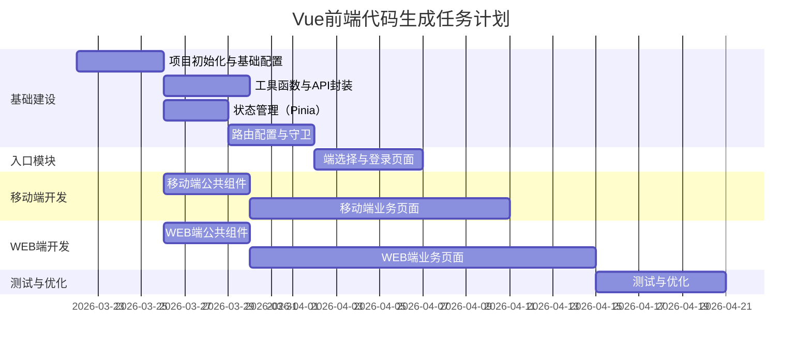

# 原子任务拆分文档 - Vue前端代码生成

## 任务拆分原则
- **复杂度可控**：单个任务预估工时不超过8人时
- **原子独立**：按功能模块分解，确保单个任务具备原子性、独立性
- **验收明确**：每个任务有明确的验收标准
- **依赖清晰**：任务依赖关系无循环、无遗漏
- **全角色覆盖**：覆盖前端开发全角色
- **文档绑定**：每个任务明确绑定输入文档与输出文档

## 原子任务列表

### 1. 项目初始化与基础配置
- **任务ID**：T001
- **所属模块**：项目基础
- **负责角色**：前端开发
- **预估工时**：4小时
- **优先级**：高
- **输入契约**：
  - 前置依赖：无
  - 输入文档：`DESIGN_vue-frontend.md`
- **输出契约**：
  - 交付物：Vue项目初始化文件、package.json配置
  - 验收标准：项目能正常构建和运行
- **实现约束**：
  - 使用Vue 3 + Composition API
  - 安装必要的依赖包（Vant UI、Element Plus、vue-router、Pinia、ECharts）
- **依赖关系**：无前置依赖

### 2. 工具函数与API封装
- **任务ID**：T002
- **所属模块**：工具层
- **负责角色**：前端开发
- **预估工时**：4小时
- **优先级**：高
- **输入契约**：
  - 前置依赖：T001
  - 输入文档：`DESIGN_vue-frontend.md`
- **输出契约**：
  - 交付物：request.js、工具函数文件
  - 验收标准：API请求能正常发送和接收模拟数据
- **实现约束**：
  - 统一封装HTTP请求
  - 提供模拟数据
  - 处理错误和异常
- **依赖关系**：T001

### 3. 状态管理（Pinia）
- **任务ID**：T003
- **所属模块**：状态管理
- **负责角色**：前端开发
- **预估工时**：3小时
- **优先级**：高
- **输入契约**：
  - 前置依赖：T001
  - 输入文档：`DESIGN_vue-frontend.md`
- **输出契约**：
  - 交付物：user.js、app.js store文件
  - 验收标准：状态能正常存储和读取
- **实现约束**：
  - 使用Pinia管理用户状态和全局配置
  - 支持持久化存储
- **依赖关系**：T001

### 4. 路由配置与守卫
- **任务ID**：T004
- **所属模块**：路由管理
- **负责角色**：前端开发
- **预估工时**：4小时
- **优先级**：高
- **输入契约**：
  - 前置依赖：T001, T003
  - 输入文档：`DESIGN_vue-frontend.md`
- **输出契约**：
  - 交付物：路由配置文件、路由守卫
  - 验收标准：路由能正常跳转，守卫能正确控制访问权限
- **实现约束**：
  - 按端类型拆分路由
  - 实现登录状态和端类型守卫
- **依赖关系**：T001, T003

### 5. 端选择与登录页面
- **任务ID**：T005
- **所属模块**：入口模块
- **负责角色**：前端开发
- **预估工时**：5小时
- **优先级**：高
- **输入契约**：
  - 前置依赖：T001, T002, T003, T004
  - 输入文档：`PRD_vue-frontend.md`, `UI_SPEC_vue-frontend.md`
- **输出契约**：
  - 交付物：端选择页、登录页组件
  - 验收标准：页面能正常显示和交互，登录功能正常
- **实现约束**：
  - 实现端选择功能
  - 实现登录表单和验证
  - 实现验证码功能
- **依赖关系**：T001, T002, T003, T004

### 6. 移动端公共组件
- **任务ID**：T006
- **所属模块**：移动端组件
- **负责角色**：前端开发
- **预估工时**：4小时
- **优先级**：中
- **输入契约**：
  - 前置依赖：T001
  - 输入文档：`UI_SPEC_vue-frontend.md`
- **输出契约**：
  - 交付物：移动端公共组件（导航栏、列表项、卡片等）
  - 验收标准：组件能正常使用和显示
- **实现约束**：
  - 使用Vant UI组件库
  - 符合移动端设计规范
- **依赖关系**：T001

### 7. 移动端业务页面
- **任务ID**：T007
- **所属模块**：移动端功能
- **负责角色**：前端开发
- **预估工时**：12小时
- **优先级**：中
- **输入契约**：
  - 前置依赖：T002, T003, T004, T006
  - 输入文档：`PRD_vue-frontend.md`, `UI_SPEC_vue-frontend.md`
- **输出契约**：
  - 交付物：移动端业务页面（客户管理、商机管理、任务中心、报表看板、消息通知、个人中心）
  - 验收标准：页面能正常显示和交互，功能完整
- **实现约束**：
  - 固定宽度375px，水平居中
  - 使用Vant UI组件
  - 实现下拉刷新和上拉加载
- **依赖关系**：T002, T003, T004, T006

### 8. WEB端公共组件
- **任务ID**：T008
- **所属模块**：WEB端组件
- **负责角色**：前端开发
- **预估工时**：4小时
- **优先级**：中
- **输入契约**：
  - 前置依赖：T001
  - 输入文档：`UI_SPEC_vue-frontend.md`
- **输出契约**：
  - 交付物：WEB端公共组件（导航栏、头部、卡片等）
  - 验收标准：组件能正常使用和显示
- **实现约束**：
  - 使用Element Plus组件库
  - 符合WEB端设计规范
- **依赖关系**：T001

### 9. WEB端业务页面
- **任务ID**：T009
- **所属模块**：WEB端功能
- **负责角色**：前端开发
- **预估工时**：16小时
- **优先级**：中
- **输入契约**：
  - 前置依赖：T002, T003, T004, T008
  - 输入文档：`PRD_vue-frontend.md`, `UI_SPEC_vue-frontend.md`
- **输出契约**：
  - 交付物：WEB端业务页面（工作台、客户管理、联系人管理、商机管理、合同管理、产品管理、订单管理、回款管理、报表中心、系统设置、个人中心）
  - 验收标准：页面能正常显示和交互，功能完整
- **实现约束**：
  - 经典后台布局
  - 使用Element Plus组件
  - 实现表格排序、筛选、分页
  - 使用ECharts展示图表
- **依赖关系**：T002, T003, T004, T008

### 10. 测试与优化
- **任务ID**：T010
- **所属模块**：测试与优化
- **负责角色**：前端开发
- **预估工时**：6小时
- **优先级**：低
- **输入契约**：
  - 前置依赖：T005, T007, T009
  - 输入文档：`PRD_vue-frontend.md`
- **输出契约**：
  - 交付物：测试报告、优化方案
  - 验收标准：系统能正常运行，无明显bug
- **实现约束**：
  - 测试所有功能模块
  - 优化性能和用户体验
  - 确保响应式适配
- **依赖关系**：T005, T007, T009

## 任务依赖甘特图

## 执行计划
1. 首先完成基础建设任务（T001-T004），搭建项目框架
2. 然后并行开发入口模块、移动端和WEB端的公共组件
3. 接着开发移动端和WEB端的业务页面
4. 最后进行测试和优化

## 检查清单
- [x] 任务计划覆盖所有需求点和设计内容
- [x] 任务依赖关系清晰，无循环依赖
- [x] 每个任务都有明确的验收标准
- [x] 每个任务都绑定了输入文档和输出文档
- [x] 任务复杂度评估合理，无不可控的高风险任务
- [x] 全角色任务边界清晰，无职责交叉