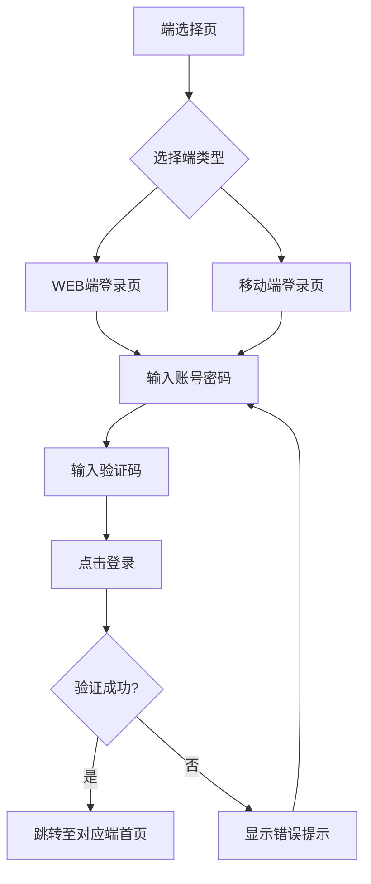
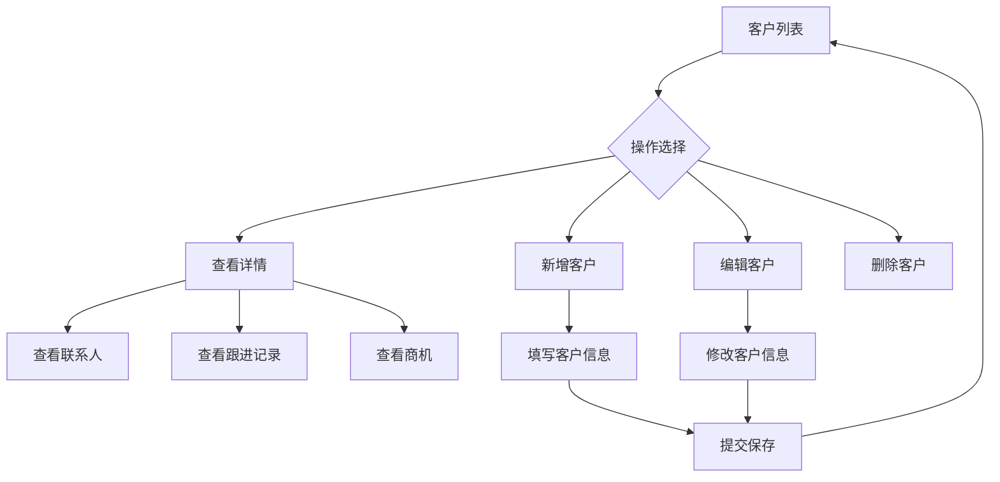
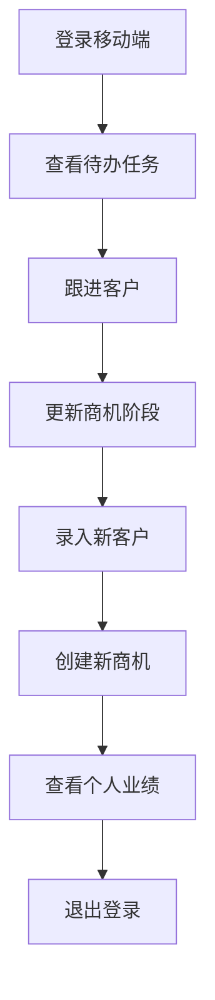
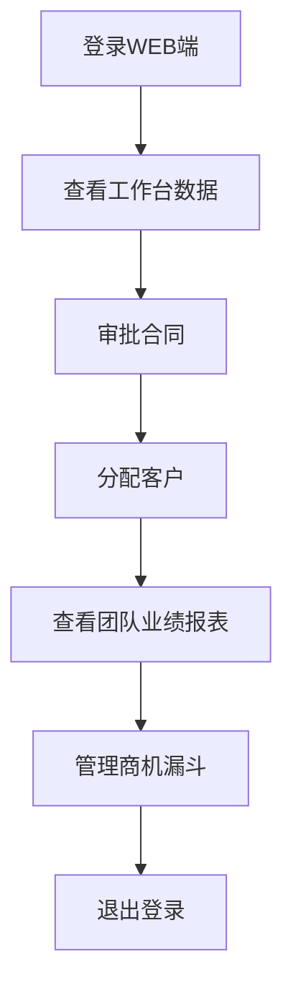
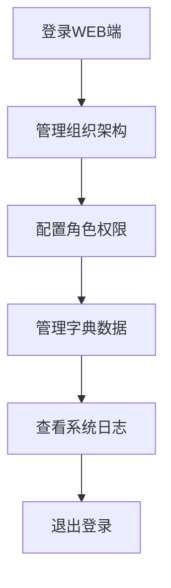

# 产品需求文档 - 智客通CRM

## 1. 需求概述
- **系统名称**：智客通CRM（SmartCustomer CRM）
- **系统目标**：实现企业客户全生命周期管理，提升销售效率和管理水平
- **核心功能**：端选择与统一登录、移动端小程序、WEB端后台管理
- **目标用户**：销售人员、销售经理、系统管理员

## 2. 功能说明

### 2.1 端选择与统一登录模块
#### 2.1.1 端选择首页
- **功能描述**：提供WEB端和移动端的选择入口
- **界面元素**：
  - 企业Logo
  - 系统名称「智客通CRM」
  - 「电脑端（WEB后台管理）」按钮
  - 「移动端（小程序）」按钮
  - 系统版本号、版权信息
- **操作流程**：
  1. 用户访问系统首页
  2. 查看系统信息
  3. 选择所需的端类型
  4. 跳转至对应端的登录页面

#### 2.1.2 统一登录页
- **功能描述**：用户登录系统，验证身份
- **界面元素**：
  - 账号输入框
  - 密码输入框
  - 图形验证码输入框
  - 「记住密码」复选框
  - 「自动登录」复选框
  - 「忘记密码」链接
  - 登录按钮
- **操作流程**：
  1. 用户输入账号密码
  2. 输入验证码
  3. 选择是否记住密码和自动登录
  4. 点击登录按钮
  5. 系统验证登录信息
  6. 登录成功后跳转至对应端首页

#### 2.1.3 权限与路由守卫
- **功能描述**：确保系统安全，控制用户访问权限
- **规则说明**：
  - 未登录用户自动跳转至端选择页
  - 登录后禁止跨端访问（如移动端用户无法访问WEB端路由）
  - Token过期自动清除状态并跳转登录页

### 2.2 移动端小程序
#### 2.2.1 客户管理
- **功能描述**：管理客户信息，包括新增、编辑、查看详情等
- **界面元素**：
  - 客户列表（支持搜索和筛选）
  - 客户详情页（基本信息、联系人、跟进记录、商机）
  - 新增/编辑客户表单
  - 客户公海池
- **操作流程**：
  1. 在客户列表查看客户信息
  2. 点击客户进入详情页
  3. 新增或编辑客户信息
  4. 在公海池领取客户

#### 2.2.2 联系人管理
- **功能描述**：管理客户联系人信息
- **界面元素**：
  - 联系人列表（关联客户展示）
  - 新增/编辑联系人表单
  - 一键拨打/发短信功能
- **操作流程**：
  1. 在联系人列表查看联系人信息
  2. 点击联系人进入详情页
  3. 新增或编辑联系人信息
  4. 一键拨打或发短信给联系人

#### 2.2.3 商机管理
- **功能描述**：管理销售商机，跟踪销售进度
- **界面元素**：
  - 商机列表（按阶段筛选）
  - 商机详情页（销售漏斗进度、预估金额、预计成交日）
  - 新增/编辑商机表单
  - 阶段推进操作
- **操作流程**：
  1. 在商机列表查看商机信息
  2. 点击商机进入详情页
  3. 新增或编辑商机信息
  4. 推进商机阶段

#### 2.2.4 任务中心
- **功能描述**：管理待办任务，提高工作效率
- **界面元素**：
  - 待办/已办任务列表（逾期标红）
  - 新增/编辑任务表单
  - 任务完成标记
- **操作流程**：
  1. 在任务列表查看待办任务
  2. 点击任务进入详情页
  3. 新增或编辑任务
  4. 完成任务标记

#### 2.2.5 报表看板
- **功能描述**：展示个人业绩概览和跟进趋势
- **界面元素**：
  - 个人业绩概览卡片
  - 近7天跟进趋势折线图
- **操作流程**：
  1. 查看个人业绩概览
  2. 分析近7天跟进趋势

#### 2.2.6 消息通知
- **功能描述**：接收系统消息和审批消息
- **界面元素**：
  - 系统消息列表
  - 审批消息列表
- **操作流程**：
  1. 查看系统消息
  2. 查看审批消息

#### 2.2.7 个人中心
- **功能描述**：管理个人信息，修改密码，退出登录
- **界面元素**：
  - 个人信息展示
  - 个人信息编辑表单
  - 修改密码表单
  - 关于系统
  - 退出登录按钮
- **操作流程**：
  1. 查看个人信息
  2. 编辑个人信息
  3. 修改密码
  4. 退出登录

### 2.3 WEB端后台管理
#### 2.3.1 工作台（首页）
- **功能描述**：提供系统概览和快捷操作
- **界面元素**：
  - 数据概览卡片（今日新增客户/商机、待办任务、待审批合同）
  - 销售漏斗图
  - 近30天业绩趋势折线图
  - 快捷操作入口
  - 公告栏
- **操作流程**：
  1. 查看数据概览
  2. 分析销售漏斗和业绩趋势
  3. 点击快捷操作进入对应模块

#### 2.3.2 客户管理
- **功能描述**：全面管理客户信息，支持批量操作
- **界面元素**：
  - 客户列表（高级筛选、批量操作）
  - 客户360°详情页
  - 新增/编辑/删除客户表单
  - 公海池管理
  - 分配/移交/合并客户操作
  - 客户导入/导出功能
- **操作流程**：
  1. 在客户列表查看和筛选客户
  2. 点击客户进入360°详情页
  3. 新增、编辑或删除客户
  4. 进行客户分配、移交或合并操作
  5. 导入或导出客户数据

#### 2.3.3 联系人管理
- **功能描述**：管理客户联系人信息，支持批量操作
- **界面元素**：
  - 联系人列表
  - 新增/编辑/删除联系人表单
  - 批量导入/导出功能
- **操作流程**：
  1. 在联系人列表查看联系人信息
  2. 新增、编辑或删除联系人
  3. 导入或导出联系人数据

#### 2.3.4 商机管理
- **功能描述**：管理销售商机，跟踪销售进度，支持赢单/输单操作
- **界面元素**：
  - 商机列表（漏斗视图切换）
  - 商机详情页
  - 新增/编辑/删除商机表单
  - 阶段推进/回退操作
  - 赢单/输单操作
- **操作流程**：
  1. 在商机列表查看和筛选商机
  2. 点击商机进入详情页
  3. 新增、编辑或删除商机
  4. 推进或回退商机阶段
  5. 标记商机赢单或输单

#### 2.3.5 合同管理
- **功能描述**：管理销售合同，支持审批流程
- **界面元素**：
  - 合同列表（状态筛选）
  - 合同详情页
  - 新建/编辑/删除合同表单
  - 审批流程（发起/通过/驳回）
  - 归档/作废操作
- **操作流程**：
  1. 在合同列表查看和筛选合同
  2. 点击合同进入详情页
  3. 新建、编辑或删除合同
  4. 发起合同审批
  5. 审批合同（通过或驳回）
  6. 归档或作废合同

#### 2.3.6 产品管理
- **功能描述**：管理产品信息，支持分类和库存预警
- **界面元素**：
  - 产品分类管理
  - 产品列表
  - 新增/编辑/删除产品表单
  - 库存预警
- **操作流程**：
  1. 管理产品分类
  2. 在产品列表查看产品信息
  3. 新增、编辑或删除产品
  4. 查看库存预警信息

#### 2.3.7 订单管理
- **功能描述**：管理销售订单，支持发货操作
- **界面元素**：
  - 订单列表
  - 新建/编辑/取消订单表单
  - 发货操作
  - 导出功能
- **操作流程**：
  1. 在订单列表查看订单信息
  2. 新建、编辑或取消订单
  3. 进行发货操作
  4. 导出订单数据

#### 2.3.8 回款管理
- **功能描述**：管理回款记录，支持审批和回款计划
- **界面元素**：
  - 回款记录列表
  - 新建回款表单
  - 审批操作
  - 回款计划
- **操作流程**：
  1. 在回款记录列表查看回款信息
  2. 新建回款记录
  3. 审批回款
  4. 查看和管理回款计划

#### 2.3.9 报表中心
- **功能描述**：提供多维度的数据分析和报表
- **界面元素**：
  - 客户报表
  - 销售报表
  - 财务报表
  - 自定义报表
  - 导出功能
- **操作流程**：
  1. 查看各类报表
  2. 分析数据
  3. 导出报表数据

#### 2.3.10 系统设置
- **功能描述**：管理系统配置，包括组织架构、角色权限等
- **界面元素**：
  - 组织架构管理
  - 角色权限管理
  - 字典管理
  - 系统日志
- **操作流程**：
  1. 管理组织架构
  2. 配置角色权限
  3. 管理字典数据
  4. 查看系统日志

#### 2.3.11 个人中心
- **功能描述**：管理个人信息，修改密码，退出登录
- **界面元素**：
  - 个人信息展示
  - 个人信息编辑表单
  - 修改密码表单
  - 退出登录按钮
- **操作流程**：
  1. 查看个人信息
  2. 编辑个人信息
  3. 修改密码
  4. 退出登录

## 3. 业务规则

### 3.1 登录规则
- 账号密码不能为空
- 验证码必须正确
- 登录失败次数超过5次，账号将被锁定1小时
- 记住密码功能可保存账号密码7天
- 自动登录功能可在下次打开系统时自动登录

### 3.2 客户管理规则
- 客户名称不能为空
- 客户电话或邮箱至少填写一项
- 客户状态包括：潜在客户、意向客户、成交客户、流失客户
- 客户公海池中的客户可被销售人员领取
- 客户分配后，负责人可查看和管理该客户

### 3.3 商机管理规则
- 商机名称不能为空
- 商机必须关联客户
- 商机阶段包括：初步接触、需求分析、方案报价、商务谈判、成交、失败
- 商机金额必须大于0
- 预计成交日必须在当前日期之后

### 3.4 任务管理规则
- 任务标题不能为空
- 任务必须指定负责人
- 任务状态包括：待办、进行中、已完成、已逾期
- 任务优先级包括：高、中、低
- 逾期任务会标红显示

### 3.5 合同管理规则
- 合同名称不能为空
- 合同必须关联客户和商机
- 合同金额必须大于0
- 合同状态包括：待审批、已通过、已驳回、已归档、已作废
- 合同审批流程：发起审批 → 部门经理审批 → 财务审批 → 总经理审批

## 4. 交互逻辑

### 4.1 端选择与登录
- 端选择页：点击按钮后跳转至对应端的登录页
- 登录页：输入账号密码和验证码后，点击登录按钮进行验证
- 登录成功：跳转至对应端的首页
- 登录失败：显示错误提示信息

### 4.2 移动端交互
- 底部导航栏：点击切换不同功能模块
- 列表页面：支持下拉刷新和上拉加载
- 详情页面：点击列表项进入详情页
- 表单页面：填写信息后提交，支持实时验证
- 弹窗：使用Vant的Dialog和Popup组件

### 4.3 WEB端交互
- 左侧导航栏：点击切换功能模块，支持折叠/展开
- 顶部Header：显示用户信息、消息通知、退出登录
- 表格：支持排序、筛选、分页
- 表单：填写信息后提交，支持实时验证
- 弹窗：使用Element Plus的Dialog组件
- 图表：使用ECharts展示数据

## 5. 异常处理

### 5.1 登录异常
- 账号密码错误：显示「账号或密码错误」提示
- 验证码错误：显示「验证码错误」提示
- 账号锁定：显示「账号已被锁定，请1小时后重试」提示
- 网络错误：显示「网络连接失败，请检查网络」提示

### 5.2 表单验证异常
- 必填字段为空：显示「请填写XX」提示
- 数据格式错误：显示「XX格式不正确」提示
- 数据范围错误：显示「XX超出范围」提示

### 5.3 API请求异常
- 400错误：显示「请求参数错误」提示
- 401错误：显示「未授权，请重新登录」提示，跳转至登录页
- 403错误：显示「无权限访问」提示
- 404错误：显示「请求资源不存在」提示
- 500错误：显示「服务器内部错误」提示

### 5.4 业务逻辑异常
- 客户已存在：显示「客户已存在」提示
- 商机阶段推进失败：显示「推进失败，请检查商机状态」提示
- 合同审批失败：显示「审批失败，请联系管理员」提示

## 6. 权限管控规则

### 6.1 角色权限
- **销售人员**：可访问移动端所有功能，WEB端仅可访问工作台、客户管理、联系人管理、商机管理、任务管理、个人中心
- **销售经理**：可访问移动端所有功能，WEB端可访问除系统设置外的所有功能
- **系统管理员**：可访问所有功能

### 6.2 端类型权限
- 移动端用户无法访问WEB端路由
- WEB端用户无法访问移动端路由

### 6.3 操作权限
- 新增/编辑/删除权限：根据角色不同有所差异
- 审批权限：仅对应审批人可进行审批操作
- 数据权限：仅可查看和管理分配给自己的客户和商机

## 7. 核心业务流程图

### 7.1 登录流程

### 7.2 客户管理流程

### 7.3 商机管理流程

```mermaid
flowchart TD
    A[商机列表] --> B{操作选择}
    B --> C[查看详情]
    B --> D[新增商机]
    B --> E[编辑商机]
    B --> F[删除商机]
    C --> G[推进阶段]
    C --> H[标记赢单/输单]
    D --> I[填写商机信息]
    I --> J[提交保存]
    E --> K[修改商机信息]
    K --> J
    G --> L{阶段推进成功?}
    L -->|是| A
    L -->|否| M[显示错误提示]
    H --> N{标记成功?}
    N -->|是| A
    N -->|否| M
    J --> A
```

## 8. 用户旅程图

### 8.1 销售人员旅程

### 8.2 销售经理旅程

### 8.3 系统管理员旅程

## 9. 数据模型与字段定义

### 9.1 用户模型
| 字段名 | 类型 | 描述 | 约束 |
| :--- | :--- | :--- | :--- |
| id | String | 用户ID | 主键 |
| username | String | 用户名 | 唯一，必填 |
| password | String | 密码 | 必填 |
| name | String | 姓名 | 必填 |
| role | String | 角色 | 必填，枚举：sales, manager, admin |
| avatar | String | 头像 | 可选 |
| createTime | Date | 创建时间 | 自动生成 |
| updateTime | Date | 更新时间 | 自动生成 |

### 9.2 客户模型
| 字段名 | 类型 | 描述 | 约束 |
| :--- | :--- | :--- | :--- |
| id | String | 客户ID | 主键 |
| name | String | 客户名称 | 必填 |
| phone | String | 联系电话 | 可选 |
| email | String | 邮箱 | 可选 |
| address | String | 地址 | 可选 |
| status | String | 状态 | 必填，枚举：potential, interested,成交, lost |
| ownerId | String | 负责人ID | 可选 |
| createTime | Date | 创建时间 | 自动生成 |
| updateTime | Date | 更新时间 | 自动生成 |

### 9.3 联系人模型
| 字段名 | 类型 | 描述 | 约束 |
| :--- | :--- | :--- | :--- |
| id | String | 联系人ID | 主键 |
| customerId | String | 客户ID | 外键，必填 |
| name | String | 姓名 | 必填 |
| phone | String | 联系电话 | 必填 |
| email | String | 邮箱 | 可选 |
| position | String | 职位 | 可选 |
| createTime | Date | 创建时间 | 自动生成 |
| updateTime | Date | 更新时间 | 自动生成 |

### 9.4 商机模型
| 字段名 | 类型 | 描述 | 约束 |
| :--- | :--- | :--- | :--- |
| id | String | 商机ID | 主键 |
| name | String | 商机名称 | 必填 |
| customerId | String | 客户ID | 外键，必填 |
| stage | String | 阶段 | 必填，枚举：contact,需求分析,方案报价,商务谈判,成交,失败 |
| amount | Number | 预估金额 | 必填，大于0 |
| expectedDate | Date | 预计成交日 | 必填，大于当前日期 |
| ownerId | String | 负责人ID | 必填 |
| createTime | Date | 创建时间 | 自动生成 |
| updateTime | Date | 更新时间 | 自动生成 |

### 9.5 任务模型
| 字段名 | 类型 | 描述 | 约束 |
| :--- | :--- | :--- | :--- |
| id | String | 任务ID | 主键 |
| title | String | 任务标题 | 必填 |
| content | String | 任务内容 | 可选 |
| status | String | 状态 | 必填，枚举：todo, in_progress, completed, overdue |
| priority | String | 优先级 | 必填，枚举：high, medium, low |
| ownerId | String | 负责人ID | 必填 |
| customerId | String | 关联客户ID | 可选 |
| businessId | String | 关联商机ID | 可选 |
| dueDate | Date | 截止时间 | 必填 |
| createTime | Date | 创建时间 | 自动生成 |
| updateTime | Date | 更新时间 | 自动生成 |

### 9.6 合同模型
| 字段名 | 类型 | 描述 | 约束 |
| :--- | :--- | :--- | :--- |
| id | String | 合同ID | 主键 |
| name | String | 合同名称 | 必填 |
| customerId | String | 客户ID | 外键，必填 |
| businessId | String | 商机ID | 外键，必填 |
| amount | Number | 合同金额 | 必填，大于0 |
| startDate | Date | 开始日期 | 必填 |
| endDate | Date | 结束日期 | 必填，大于开始日期 |
| status | String | 状态 | 必填，枚举：pending, approved, rejected, archived, cancelled |
| createTime | Date | 创建时间 | 自动生成 |
| updateTime | Date | 更新时间 | 自动生成 |

## 10. 报表与埋点需求

### 10.1 报表需求
- **个人业绩报表**：展示销售人员的新增客户数、商机数、成交金额
- **团队业绩报表**：展示销售团队的整体业绩情况
- **客户分析报表**：展示客户分布、状态变化、来源分析
- **商机分析报表**：展示商机漏斗、阶段转化、预测分析
- **财务报表**：展示收入、回款、应收账款等财务数据

### 10.2 埋点需求
- **登录埋点**：记录登录次数、登录方式、登录结果
- **操作埋点**：记录新增、编辑、删除等操作的次数和结果
- **页面埋点**：记录页面访问次数、停留时间、跳出率
- **业务埋点**：记录商机推进、合同审批等业务流程的执行情况

## 11. 合规适配方案

### 11.1 数据隐私保护
- 敏感数据脱敏显示
- 数据传输加密
- 数据访问权限控制
- 符合GDPR数据保护要求

### 11.2 安全合规
- 密码加密存储
- 防止SQL注入攻击
- 防止XSS攻击
- 防止CSRF攻击
- 定期安全审计

### 11.3 操作合规
- 操作日志记录
- 审批流程合规
- 数据变更追踪
- 符合行业监管要求

## 12. 非功能需求

### 12.1 性能需求
- 页面加载时间：移动端 < 2秒，WEB端 < 3秒
- 响应时间：操作响应 < 1秒
- 并发处理：支持1000用户同时在线

### 12.2 可用性需求
- 系统可用性：99.9%
- 故障恢复时间：< 30分钟
- 备份策略：每日自动备份

### 12.3 可维护性需求
- 代码可读性：符合编码规范
- 文档完整性：提供完整的系统文档
- 日志记录：详细的操作日志和错误日志

### 12.4 兼容性需求
- 移动端：支持iOS 12+、Android 6+，适配不同屏幕尺寸
- WEB端：支持Chrome、Firefox、Safari、Edge等主流浏览器，分辨率1366x768及以上

### 12.5 可扩展性需求
- 模块化设计：支持功能模块的独立开发和部署
- 插件机制：支持第三方插件集成
- API接口：提供标准化的API接口，支持与其他系统集成